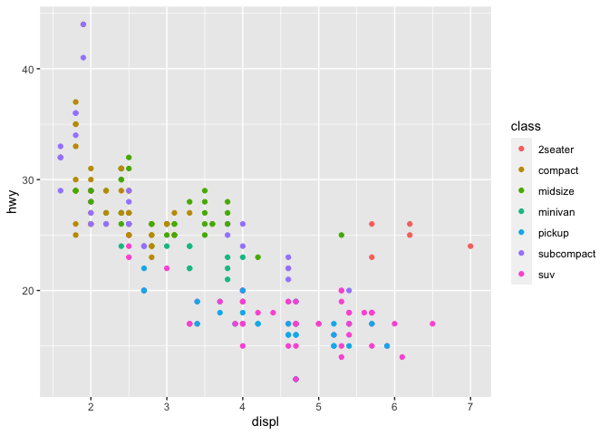
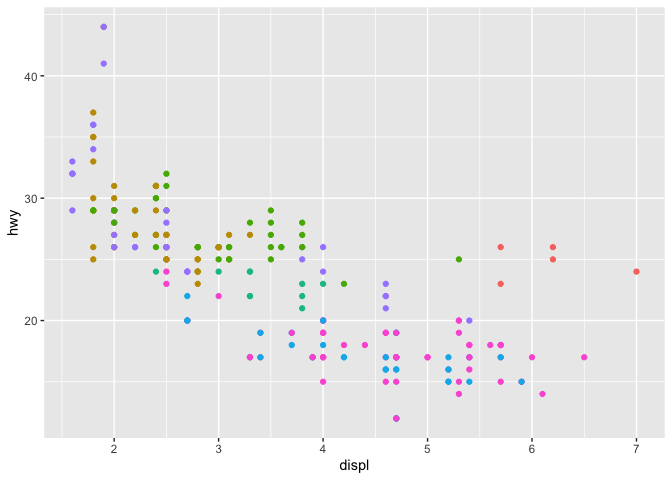
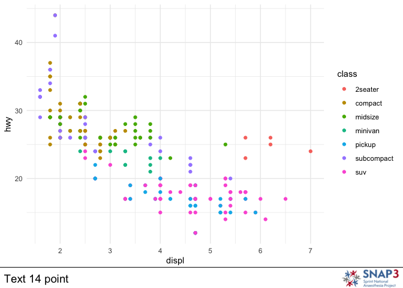
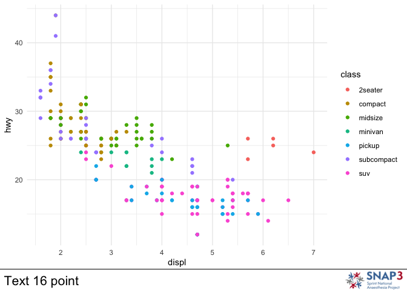

<!-- README.md is generated from README.Rmd. Please edit that file -->

# testpackage

<!-- badges: start -->
<!-- badges: end -->

The goal of testpackage is to provide some helper functions for people
working with HSRC or other projects.

There are currently three independent tools.

`pretty_plot` adds a logo and some text (e.g. source, date etc) to a
plot. `theme_HSRC` creates a ggplot theme `QR_save` generates a series
of QR codes from a csv file of URLs and titles. Useful for
presentations.

## Installation

You can install the development version of testpackage from
[GitHub](https://github.com/) with:

``` r
# install.packages("devtools")
devtools::install_github("IainMoppett/testpackage")
```

## Example

### QR_save

Use the `QR_save` function to save a series of pdfs of QR codes with a
helpful title. Online tools tend to give a rather unhelpful ‘file.png’
as the output.

``` r
library(testpackage)
## basic example code

QR_save(system.file("extdata", "QR_Data.csv", package = "testpackage"))
#> Rows: 3 Columns: 2
#> ── Column specification ────────────────────────────────────────────────────────
#> Delimiter: ","
#> chr (2): URL, Title
#> 
#> ℹ Use `spec()` to retrieve the full column specification for this data.
#> ℹ Specify the column types or set `show_col_types = FALSE` to quiet this message.
```

### Pretty_plot

Adds a logo at the bottom right and some text (e.g. data source) at the
bottom left.


